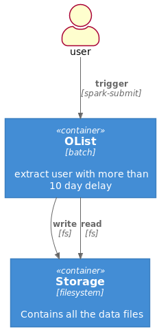
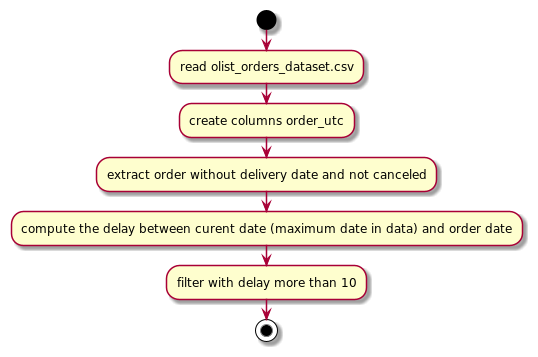
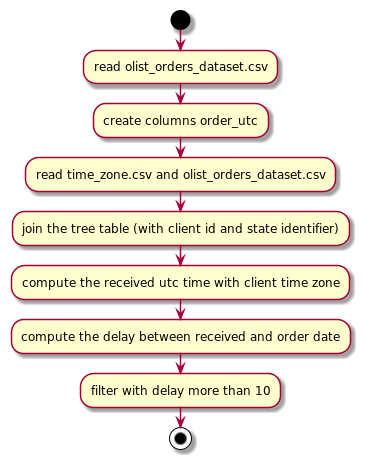
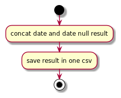
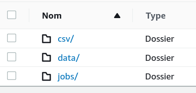
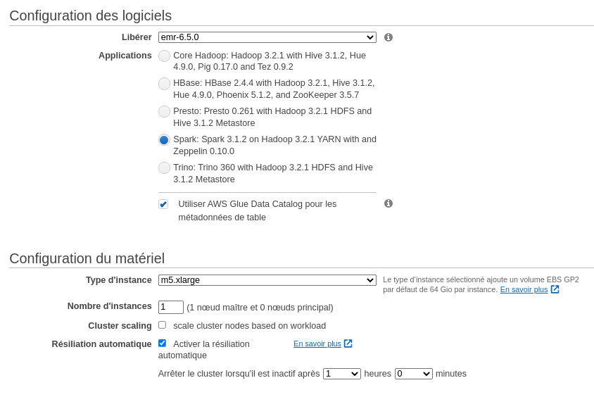
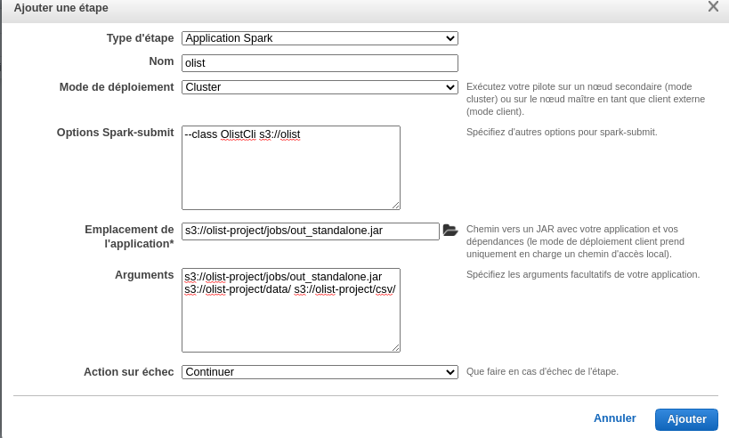
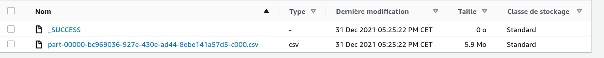

# OList project

Table of contents:

1. [information](#information)
2. [architecture](#architecture)
3. [execute the batch locally](#execute-the-batch-locally)
4. [pakcage the batch](#package-the-batch)
5. [run the batch on aws](#run-the-batch-on-aws)

## Information

The data used for this project is the [olist data](https://www.kaggle.com/olistbr/brazilian-ecommerce) from kaggle. This
is data from Brazilian E-commerce.

The objective of this project is to extract all user who have received delivery with more than 10 day delay.

In order to make the project more interessting their are some contraints on the times data:

1. order_purchase_timestamp is by default in Sao Paulo timezone
2. order_delivered_customer_date is by default in the customer delivery address timezone

In order to work with all the timezone of brazil I had a csv with the timezone for each state. (This data comme from
wikipedia [brazilian time zone](https://en.wikipedia.org/wiki/Time_in_Brazil)
and [brazilian states](https://en.wikipedia.org/wiki/Federative_units_of_Brazil))

To discover the data and test some piece of code I use a notebook, it is the olist.ipynb in the repository. To execute
cells you need jupyter notebook with spylon kernel.

## architecture

The architecture of this project is based on batch olist application and file system.



The olist batch is composed of 3 steps:

1. get the user with more than 10 days delay and who didn't receive the order (except if the order is canceled)



2. get the user with more than 10 days delay and who received the order



3. merge the both result



## Execute the batch locally

1. clone the repo

```shell
git clone https://github.com/souff/olist.git
```

2. run the batch with mill

```shell
mill batch.standalone.run
```

## package the batch

### package for spark

1. assembly with mill

```shell
mill batch.assembly
```

2. run with spark submit

```shell
spark-submit --class OlistCli out/batch/assembly.dest/out.jar            
```

### package standalone

1. assembly with mill

```shell
mill batch.standalone.assembly
```

## Run the batch on AWS

### With AWS interface

1. Create an S3 bucket and upload file:
    1. jar file in jobs folder (you need to use the standalone jar)
    2. csv in data folder

   

2. Create the EMR cluster, use the same version of spark that you have locally. You can use this screen for the
   configuration:
   
   Let the other parameter by default.

3. create the step:
    1. Spark application
    2. spark-submit option: --class OlistCli s3://olist
    3. jar, choose the jar upload on S3
    4. arguments, the S3 uri of your data and output folder (replace the bucket name by yours): s3:
       //olist-project/jobs/out_standalone.jar s3://olist-project/data/ s3://olist-project/csv/
       

You can see the success of the step in the interface:


To get the result you can access to the S3 bucket:



