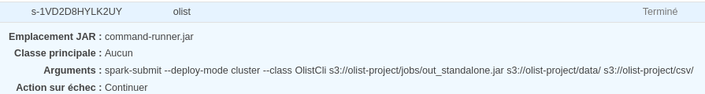

# OList project

Table of contents:

1. [information](#information)
2. [execute the batch locally](#execute-the-batch-locally)
3. [pakcage the batch](#package-the-batch)
4. [run the batch on aws](#run-the-batch-on-aws)

## Information

## Execute the batch locally

1. clone the repo

```shell
git clone 
```

2. run the batch with mill

```shell
mill batch.standolone.run
```

## package the batch

### package for spark

1. assembly with mill

```shell
mill batch.assembly
```

2. run with spark submit

```shell
spark-submit --class OlistCli out/batch/assembly.dest/out.jar            
```

### package standalone

1. assembly with mill

```shell
mill batch.standalone.assembly
```

## Run the batch on AWS

### With AWS interface

1. Create an S3 bucket and upload file:
    1. jar file in jobs folder (you need to use the standalone jar)
    2. csv in data folder

   

2. Create the EMR cluster, use the same version of spark that you have locally. You can use this screen for the
   configuration:
   
   Let the other parameter by default.

3. create the step:
    1. Spark application
    2. spark-submit option: --class OlistCli s3://olist
    3. jar, choose the jar upload on S3
    4. arguments, the S3 uri of your data and output folder (replace the bucket name by yours): s3:
       //olist-project/jobs/out_standalone.jar s3://olist-project/data/ s3://olist-project/csv/
       

You can see the success of the step in the interface:


To get the result you can access to the S3 bucket:


